# llm-banking-assistant

This is a full-stack AI-powered chatbot tailored for banking interactions. It features a modern React + TypeScript frontend styled with MUI and a Node.js + Express backend that communicates with an LLM-based API using `ollama-node`.

## Project Structure

* **Frontend**: React + TypeScript, Material UI
* **Backend**: Node.js + Express + TypeScript
* **LLM API**: Powered via `ollama-node`
* **Environment Configuration**: `.env` file for backend secrets and port setup

---

## Agentic AI Architecture

### Overview
This project implements a hierarchical agent architecture, where specialized AI agents work together under the coordination of a central coordinator. This approach allows for complex banking interactions to be broken down into manageable, specialized tasks while maintaining context and state across the system.

## 🎥 Demo Video

Experience the LLM-powered banking assistant in action:

[▶️ Watch Demo Video](media/video2408770171%20(1).mp4)

> The demo showcases multi-agent collaboration, real-time chat streaming, and how the system responds to transaction queries, fraud alerts, and balance checks.

### Architecture Diagram

```mermaid
graph TD
    A[User Query] --> B[AgentCoordinator]
    B --> C{Intent Classification}
    C -->|Inquiry| D[InquiryAgent]
    C -->|Transaction| E[TransactionAgent]
    C -->|Fraud| F[FraudDetectionAgent]
    C -->|Advice| G[AdvisorAgent]
    C -->|Verification| H[VerificationAgent]
    D --> I[Response]
    E --> I
    F --> I
    G --> I
    H --> I
    I --> J[User]
```

### Agent Hierarchy

### Key Components

#### 1. AgentCoordinator
- **Role**: Central orchestrator of the agent system
- **Responsibilities**:
  - Intent classification
  - Query routing
  - State management
  - Verification handling
  - Response aggregation
- **Key Methods**:
  - `processUserQuery()`: Main entry point for user interactions
  - `classifyIntent()`: Determines the type of query
  - `handleTransactionQuery()`: Manages transaction-specific logic

#### 2. Specialized Agents
Each agent implements the `BankingAgent` interface with specific roles and capabilities:

##### InquiryAgent
- Handles general banking inquiries
- Manages balance checks
- Provides account information
- [View Implementation](backend/src/agents/inquiryAgent.ts)

##### TransactionAgent
- Manages money transfers
- Handles bill payments
- Processes transaction confirmations
- [View Implementation](backend/src/agents/transactionAgent.ts)

##### FraudDetectionAgent
- Monitors for suspicious activity
- Analyzes transaction patterns
- Provides security recommendations
- [View Implementation](backend/src/agents/fraudDetectionAgent.ts)

##### AdvisorAgent
- Provides financial advice
- Analyzes spending patterns
- Offers investment recommendations
- [View Implementation](backend/src/agents/advisorAgent.ts)

##### VerificationAgent
- Manages user authentication
- Handles security questions
- Maintains verification state
- [View Implementation](backend/src/agents/verificationAgent.ts)

### Communication Flow

### State Management
- **Verification State**: Maintained per user session
- **Transaction Context**: Preserved during multi-step operations
- **Memory Management**: Handles conversation history and context
- **Audit Logging**: Tracks all agent interactions

### Benefits of This Architecture
1. **Modularity**: Each agent handles specific banking tasks
2. **Scalability**: Easy to add new specialized agents
3. **Maintainability**: Clear separation of concerns
4. **Reliability**: Robust error handling and state management
5. **Security**: Centralized verification and fraud detection

### Future Agent Enhancements
1. **Multi-Agent Collaboration**: Enable agents to work together on complex tasks
2. **Learning Capabilities**: Implement agent-specific learning from interactions
3. **Dynamic Role Assignment**: Allow agents to take on different roles based on context
4. **Enhanced Memory**: Implement more sophisticated context management
5. **Agent Performance Metrics**: Track and optimize agent effectiveness

---

## Features

* Conversational UI with clear bot/user distinction
* MUI-driven components for polished UX
* Robust error and loading state handling
* Decoupled API integration for LLM responses
* Type-safe architecture across frontend and backend

---

## Architecture & Design Highlights

* **Frontend**  
   * Built with React 18 and TypeScript for type safety and scalability  
   * Custom UI theme using Material UI (`@mui/material`)  
   * Stateless functional components with React Hooks (`useState`)  
   * Isolated UI components for rendering user/bot messages  
   * Responsive layout using `Container`, `Box`, and MUI's system props
* **Backend**  
   * Express.js server in TypeScript for clean, modular structure  
   * Uses `ollama-node` to handle streaming LLM responses  
   * Middleware-managed CORS and JSON body parsing  
   * Structured API route (`/api/chat/message`) for message processing  
   * Environment-driven configuration with `.env` for security and portability
* **Integration**  
   * Frontend sends POST requests to backend API endpoint  
   * Backend processes input and returns real-time LLM-based chatbot responses  
   * Loading and error UI states handled gracefully on the client side

---

## Scalability & Extensibility Considerations

* **Model Swappability**: The backend is designed to support easy integration with different LLM providers (OpenAI, Ollama, etc.) via a clean abstraction layer.
* **API Versioning**: API routes are namespaced (`/api/chat`) to allow for future versions without breaking existing clients.
* **Component Isolation**: UI logic is modularized to allow for rapid feature development or UI redesigns without regressions.
* **State Management Readiness**: While `useState` is currently used, the architecture supports seamless migration to `Redux` or `Zustand` if global state becomes complex.
* **Deployment Ready**: Environment configurations are separated for frontend and backend, supporting deployment to Vercel, Netlify, Heroku, or containerized environments.
* **Security Focus**: Secrets and API keys are never exposed on the client; `.env` usage and proxy setup ensure safe API interactions.

---

## Technologies Used

* **React 18** with `create-react-app` (TypeScript)
* **Material UI** for component styling
* **Node.js** with `express` and `cors`
* **Ollama Node** for LLM interaction
* **TypeScript** across the stack

---

## Future Enhancements

* **Authentication Integration**: Add login support with OAuth2 and session persistence
* **Chat History Storage**: Persist user conversations with a database like PostgreSQL or MongoDB
* **Multi-Agent Flow**: Enable routing between specialized AI agents (e.g., loan advisor, fraud alert, account summary)
* **Real-time Streaming**: Enhance UX with token-by-token message streaming from the backend
* **Voice Input**: Integrate Web Speech API for hands-free interaction
* **Analytics Dashboard**: Track user engagement, message frequency, and model performance 
